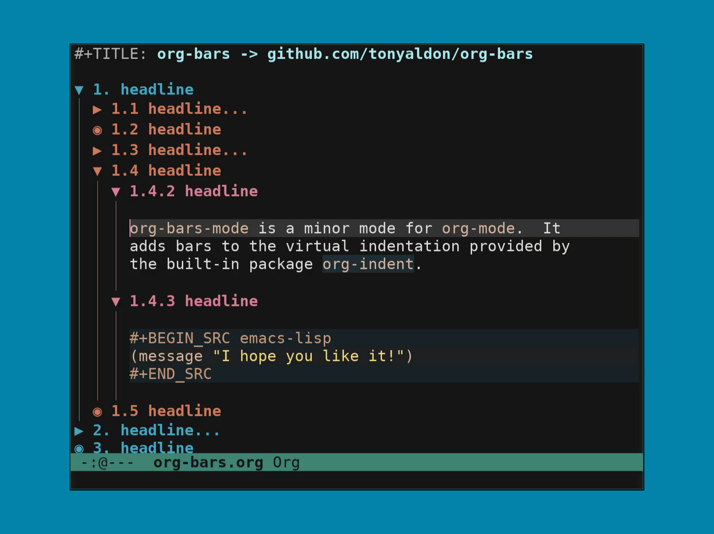

# About

`org-bars-mode` is a minor mode for `org-mode`.  It adds bars to the
virtual indentation provided by the built-in package `org-indent`.



# Install

Put [org-bars.el](./org-bars.el) in your load path and add this to
your init file:

```elisp
(require 'org-bars)
(add-hook 'org-mode-hook #'org-bars-mode)
```

# Options

`org-bars` will respect the following org options you've already set:
1. `org-indent-indentation-per-level`,
2. `org-cycle-level-faces`,
3. `org-n-level-faces`,
4. `org-level-faces`.

If you want all the bars to have the same color, for instance
the color `#8c8c8c`, set the variable `org-bars-color-options`
like this:

```
(setq org-bars-color-options '(:only-one-color t
                               :bar-color "#8c8c8c"))
```

If you want the bars to have the same colors as the headlines
depending of outline levels (this is the default), set the
variable `org-bars-color-options` like this:

```
(setq org-bars-color-options nil)
```

You can add saturation and darkness to the bar's colors (when they
inherit the headline color) by setting the properties
`:desaturate-level-faces` and `:darken-level-faces` of the variable
`org-bars-color-options`.  For instance like this:

```
(setq org-bars-color-options '(:desaturate-level-faces 30
                               :darken-level-faces 15))
```

The default heading stars are `◉` for empty headlines (`:empty`), `▶`
for folded headlines (`:invisible`) and `▼` for open headlines
(`:visible`).

If you want to modify the heading stars you can do it by modifying the
variable `org-bars-stars` as follow:

```elisp
(setq org-bars-stars '(:empty "*"
                       :invisible "+"
                       :visible "-"))
```

If you prefer the stars to have different faces than the headlines
faces, you can do it by setting the faces `org-bars-star-empty`,
`org-bars-star-invisible` and `org-bars-star-visible` as shown below:

```elisp
(custom-set-faces
 '(org-bars-star-empty ((t (:foreground "#8c8c8c"))))
 '(org-bars-star-invisible ((t (:foreground "#8c8c8c"))))
 '(org-bars-star-visible ((t (:foreground "#8c8c8c")))))
```

This is not specific to `org-bars-mode`, but since `org-bars-mode`
update the heading stars when the visibility changes (see:
`org-bars-refresh-stars` function), you might want to not use the
ellipsis `...` at the end of the folded headlines.  You can do this
by adding this code snippet to your init file:

```elisp
(defun org-no-ellipsis-in-headlines ()
  "Remove use of ellipsis in headlines.
See `buffer-invisibility-spec'."
  (remove-from-invisibility-spec '(outline . t))
  (add-to-invisibility-spec 'outline))

(add-hook 'org-mode-hook 'org-no-ellipsis-in-headlines)
```

ps: note that you can't remove the ellipsis by setting `org-ellipsis`
variable to the empty string `""`.

If the bars are not continuous, try to increment the variable
`org-bars-extra-pixels-height`.  The default value is `6`.

If you don't use different font heights for headlines and
regular text, you can set `org-bars-extra-pixels-height` to `0`.

# org-bars and company-mode

If you want to use `org-bars-mode` and you are using `company-mode` to
get inbuffer code completion, you must use [company-posframe](https://github.com/tumashu/company-posframe).

Indeed, `org-bars-mode` uses images on the `line-prefix` properties
and this makes the text in the company tooltip not aligned.

`company-mode` doesn't cover this unusual case but as
`company-posframe` uses child frame as tooltip (and not overlay)
everything is ok.

# limitations

1. `org-bars-mode` doesn't work on display that can't display images.
2. If you use `face-remap-add-relative` to set the faces of the
   headlines (`org-level-1`, ..., `org-level-8`), due to how the
   height of those faces is calculated to produce the XPM images put
   in the `line-prefix` and `wrap-prefix` text properties of the
   buffer, **this won't work correctly**, and the bars might not be
   continuous.
3. `org-inlinetask` seems to work but has not yet been covered properly.
